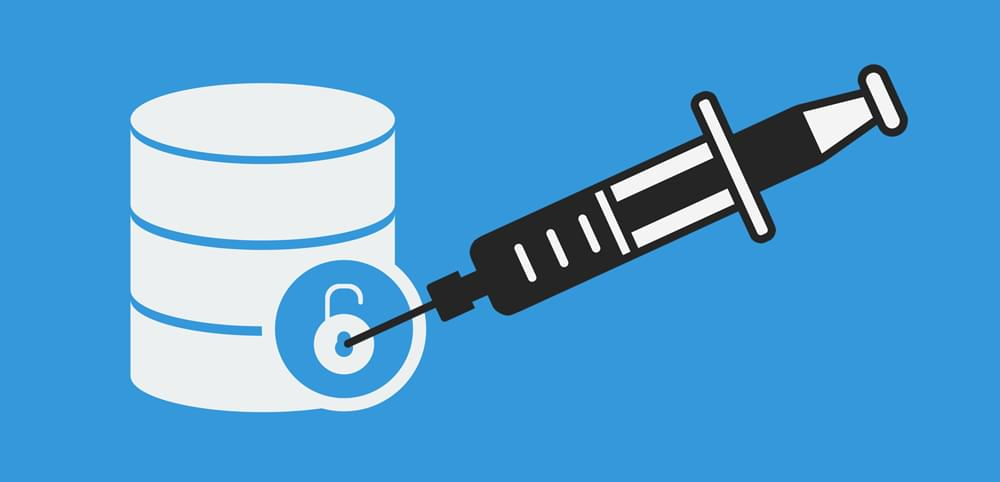

# Rails - Why pure string condition is not safe?

If you're a Rails guy, you always hear that you should not use **pure string condition** because it is not safe. Here is the note from Rails guide official page:

>Building your own conditions as pure strings can leave you vulnerable to SQL injection exploits.
>For example, Client.where("first_name LIKE '%#{params[:first_name]}%'") is not safe.
>See the next section for the preferred way to handle conditions using an array.

Especially if you're a NUSer, at the first days you got familiar with Rails your trainer always told you that you shouldn't use **pure string conditions** when building a sql query. But your trainer might not tell you why we shouldn't use it in details. Do you ever wonder why we should not use it, why it is not safe? The problem of  **pure string SQL** (I call **pure string SQL** because in this post we will investigate on many SQL clauses instead of just only **WHERE** clause) is SQL Injections. Hacker can make your database go to hell just by some very simple words if you use **pure string SQL** and you do not have any concern about SQL Injections.

To clarify what I said above, I'll give you some examples to show you how hacker can make you hurt easily! And I also tell you how to keep your code safe in these examples.

### Injection in **delete_all**

This snippet deletes all users despite any conditions:

    params[:id] = "1) OR 1=1--"
    User.delete_all("id = #{params[:id]}")

Here is the generated sql query: `DELETE FROM "users" WHERE (id = 1) OR 1=1--)`

**To be safe, never pass user input directly to delete_all method.**

### Injection in **exists?**

The **exists?** method is for checking whether a record exists with a condition. If the argument is a string, Rails will sanitize it and query against the primary key column. If the argument is an array or hash, Rails will treat it as a conditions option. The below query is dangerous:

    User.exists? params[:user]

Because Rails will automatically convert parameters to arrays or hashes, hacker can inject any SQL into this query. For example, if a user pass a query string like this `?user[]=1`, so the param[:user] will be ['1'] and the generated query is:

    SELECT  1 AS one FROM "users"  WHERE ("1") LIMIT

This query will always return **true**. 

**To be safe, always convert user’s input to a string or integer if using it as the primary key in `exists?`**

### Injection in **pluck**

Method **pluck** accepts all SQL statements. This allows a hacker to completely control the query from **SELECT** clause. Here is how a hacker can steal your users’s passwords:

    params[:column] = "password FROM users--"
    Product.pluck(params[:column])

=> Result: `SELECT password FROM users-- FROM "products"`

### Injection in **where**

A hacker can bypass authentication easily by using a simple SQL injection.

    params[:email] = "') OR 1--"
    User.where("email = '#{params[:email]}' AND password = '#{params[:password]}'")

=> Result:  `SELECT "users".* FROM "users" WHERE (email = '') OR 1--' AND password = '')`

## Conclusion

There are many other methods which a hacker can inject his SQL into. With some above simple examples, now I think you understand the risk of **pure string SQL**. To make your sql query safe, you should always remember that array and hash conditions should have the highest priority. Use them whenever you can, if cannot and you have to use **pure string SQL** you need to aware about SQL Injection and use other way to escape your sql query such as `ActiveRecord::Base.sanitize` method.
